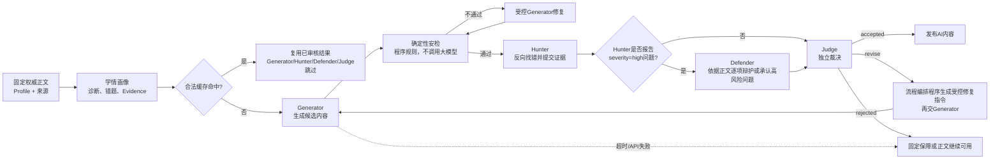
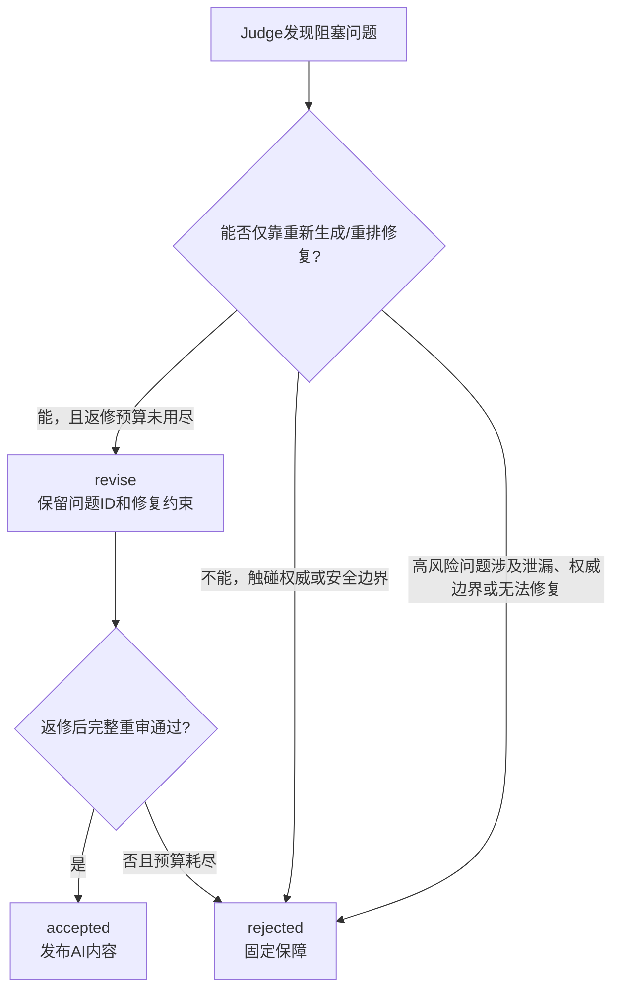

# 多Agent审计链路逻辑与可视化说明

> 用途：作为PPT、演示视频、案例报告和测试报告的统一口径。
>
> 重要边界：本文同时记录“当前代码事实”和“目标修订流程”。提交材料只能把已经有真实 `runId`、时间线和 `resultOrigin` 证据的行为写成已实现；目标流程必须标为待修订或待验证。
>
> 负责人裁决（2026-08-28）：Hunter负责提出问题而不拥有路由和裁决权；只有Hunter报告至少一项 `severity=high` 的问题时才触发Defender。Judge必须综合正文、候选、Hunter问题和必要的Defender辩护独立裁决，可以推翻Hunter的错误指控；普通可修复问题优先返回Generator完整重生成，不能直接包装成拒绝。

## 一、先看全局：一条内容如何被决定



这条链的核心不是“Agent越多越好”，而是把不同性质的工作分开：

| 层次 | 负责什么 | 能不能改权威事实 |
|---|---|---:|
| Profile与正文 | 提供教学事实、规则、来源和活动资产 | 不能由Agent改写 |
| 学情画像 | 汇总诊断、错题、Evidence，解释薄弱点 | 不能改答案、路径或评分 |
| Generator | 根据正文和安全画像生成候选导学/题组 | 只能产出候选 |
| 安检 | 用确定性代码检查结构、来源、重复、泄漏和边界 | 不能凭语义臆测 |
| Hunter | 逐题找错，提交问题、严重度和证据 | 不能直接返修或发布 |
| Defender | 只在Hunter报告高风险问题时触发，依据正文逐项辩护；Hunter有理时如实承认 | 不能重写题目或决定问题最终成立 |
| Judge | 综合正文、候选、Hunter指控和必要的Defender辩护独立裁决 | 不能修改正文、判分或隐藏资产 |
| 发布 | 绑定最终产物或标记固定保障 | 只发布已闭合结果 |

## 二、每个工位到底做什么

### 1. 教学依据与学情画像

输入是当前Session绑定的正文版本、公开来源、诊断答案、历史Evidence和上一轮错题。输出是安全的上下文摘要，例如“上一轮3道错题，薄弱知识点为 `pandas.clean.read-csv`”。

学情画像可以决定“下一组题重点考什么”和“提醒应该怎样解释”，但不能改变：

- 正文中的事实；
- 正确答案和正式判分；
- 学习路径和跳过资格；
- 代码测试点和隐藏评测。

### 2. Generator：产生候选，不等于最终内容

Generator读取当前章节的正式正文和允许使用的来源，并在有补救上下文时读取上一轮错题和画像建议。它返回候选题组或个性化提醒，候选必须携带题目ID、来源和结构化反馈。

Generator的输出不能直接展示。即使模型请求成功，也可能出现：

- `correctAnswer` 与选项不逐字一致；
- 题量、字段或ID不符合合同；
- 题目超出正文；
- 题目重复或答案位置失衡；
- 解析与题干不一致。

### 3. 安检：确定性闸门，不是大模型Agent

安检在页面上作为独立工位显示，但它不调用DeepSeek。它用程序规则检查：

- JSON Schema和必填字段；
- 答案是否属于选项且逐字一致；
- 题量、ID唯一性和旧题排除；
- 来源是否绑定当前正文；
- 跨题泄漏、敏感信息和越权字段；
- 题目重复、选项重复和答案分布规则。

安检不通过时，只能生成一个“失败类别”，由流程编排程序给Generator发送定向修复要求。修复后必须重新过安检，不能跳过。

### 4. Hunter：检察方，只找错不下最终命令

Hunter对通过安检的候选逐题反向检查：题干、选项、答案、解析能否被正文唯一支持，题目是否清楚，是否存在多解、事实错误、来源不足、题目复用或跨题提示。

Hunter的目标输出应包含：

```text
issues[]
  issueId
  severity: low | medium | high
  category
  candidateField
  message
  evidenceSummary
  sourceAnchorIds
  disputed
recommendedVerdict
```

Hunter只能提交问题和证据，不能直接调用Generator，也不能自行决定发布、返修、拒绝或是否触发Defender。`recommendedVerdict`和`disputed`只提供审查语境；服务端程序只根据是否存在 `severity=high` 的问题决定是否触发Defender，Judge必须独立复核全部问题。

### 5. Defender：只处理Hunter报告的高风险问题

Defender不是第二个Hunter，也不是最终裁判。只有Hunter报告至少一项 `severity=high` 的问题时才触发。它从候选内容的辩护角度出发，依据正式正文和允许来源逐项寻找反证；但辩护必须服从事实，如果Hunter的证据确实成立，Defender必须明确承认，不能为了角色立场强行反驳。例如：

- 答案是否被正文唯一支持；
- 题目是否多解或存在歧义；
- 解析是否曲解正文；
- 高风险候选是否仍有残余风险；
- Hunter与Generator结论冲突。

上述语义问题只有被Hunter判定为 `high` 时才进入Defender；相同类别如果只是 `low/medium`，仍然直接交给Judge，不额外消耗Defender调用。

Hunter只报告 `low/medium` 问题时直接跳过Defender并交给Judge。以下问题通常可以由安检直接确定，不应进入Hunter或Defender：字段缺失、ID重复、答案不在选项、来源ID不存在等。

是否触发Defender不能由Hunter的 `requiresDefender` 自报字段决定。程序路由规则固定为：

```text
highRiskIssues = Hunter issues 中 severity=high 的问题
highRiskIssues.length > 0 → 触发Defender
否则 → 跳过Defender，直接交给Judge
```

Defender只处理 `highRiskIssues`，每项输出应包含 `issueId`、`position=rebutted|conceded`、`rationale`、`sourceAnchorIds` 和 `residualRisk`。`rebutted`表示Defender找到了正文支持的有效反证；`conceded`表示Hunter的指控有事实依据，Defender如实承认当前候选存在该风险。两者都只是提交给Judge的审查意见，问题是否最终成立仍由Judge决定。跳过Defender时必须记录“未发现高风险问题，按条件跳过”，让页面上的节流结果可解释。

### 6. Judge：唯一的最终裁决者

Judge同时读取正文、候选、安检结果、全部Hunter问题和（如触发的）高风险问题Defender辩护。它不能只看JSON结构，必须独立复核内容语义和安全边界。

Hunter和Defender的输出都是审查意见，不是既定事实。即使Defender选择 `conceded`，Judge仍须独立核对正文、候选和双方理由；反过来，即使Defender选择 `rebutted`，Judge也可以确认候选确实存在问题。

| Judge裁决 | 含义 | 后续动作 |
|---|---|---|
| `accepted` | 候选没有实质问题，或Hunter指控经独立复核不成立 | 发布AI内容并写入合法缓存 |
| `revise` | Judge确认候选存在真实且可修复的问题 | 由流程编排程序根据Judge确认的问题生成受控修复要求，再交Generator；修复后完整重审 |
| `rejected` | 不允许或不值得继续修复 | 固定保障，或只保留正式正文 |

Judge应逐项返回 `issueDecisions`，明确Hunter问题是 `upheld`（成立）还是 `overruled`（不成立），并提供基于正文的安全理由。Judge独立复核候选时如发现Hunter遗漏的问题，应通过 `additionalIssues` 记录；最终 `blockedIssueIds` 只能引用Judge已经确认成立的Hunter问题或Judge新增问题。Judge不能修改题目、答案、Rubric、隐藏测试、Evidence、KnowledgeState或路径。

## 三、什么时候是 `revise`，什么时候是 `rejected`



应当返回 `revise` 的例子：

- 正确答案位置明显失衡；
- 题干含混但知识点可以保留；
- 解析与答案不完全一致；
- 重做题遗漏上一轮某个薄弱知识点；
- 新题与旧题过于相似但可以换场景。

必须返回 `rejected` 的例子：

- 泄漏隐藏测试、reference solution、私有Rubric或凭据；
- 正文不支持该结论，必须编造事实或来源；
- 需要修改权威判分、路径或用户掌握状态才能通过；
- Judge综合Defender辩护后，确认仍存在无法修复的高风险问题；
- Judge授权返修后仍重复出现同一严重问题，返修预算耗尽。

## 四、当前版本真实行为与修订边界

### 已经真实实现

- Generator、Hunter、Defender、Judge的运行记录和SSE时间线；
- 安检作为确定性规则工位，不调用模型；
- 安检失败后的Generator受控修复；
- Hunter输出格式错误时的一次Hunter合同重试；
- Judge返回 `revise` 后的一次受控Generator返修，并从Safety开始完整重审；
- Judge的 `accepted` 和 `rejected` 结果；
- API失败、超时、结构错误和审核不通过时明确标记固定保障；
- 合法缓存命中时跳过重复审核，并记录复用来源。

### 整改后的状态

当前代码已经接通并验证“Judge授权返修 → Generator → 安检 → Hunter → 必要时Defender → Judge”的闭环。角色权限、high-only路由、逐项证据合同、Judge独立裁决、合同失败与正式拒绝区分、accepted证明绑定、Safety审计、超时所有权和公开时间线均已按本文标准实现。

网页与 `demo/live` 组合根唯一使用 `AdaptiveContentService`；旧 `ReviewOrchestrator` 仅作为历史W2/W3 checkpoint的兼容审查器，复用共享审核策略，不参与产品候选生成、返修、缓存或发布。兼容器将 `revise` 映射为历史审查fallback，不得作为产品动态返修行为的证据。

仍需保持的硬约束：Hunter不直接返修；Defender不拥有事实认定权；Judge确认的问题才可进入Generator修复指令；修复候选必须完整重审；返修次数有限；每次返修写入同一 `runId` 的顺序记录；公开时间线只展示脱敏类别、计数和裁决，来源锚点在工位审计详情中按需查看，不泄漏答案或私有评测资产。

## 五、两类真实案例应该怎样解释

### 案例A：Hunter合同重试，但最终成功

```text
Generator → 安检通过 → Hunter第一次输出结构不合格
→ Hunter合同重试 → Hunter issues=[]
→ Defender未触发 → Judge accepted → 发布ai_live
```

这里的两次Hunter不是重复找同一个错误，而是第一次结果不能被程序安全解析，第二次才形成有效审查结论。

### 案例B：Hunter发现普通可修复问题

```text
Generator → 安检通过 → Hunter报告medium问题
→ Defender未触发（没有severity=high问题）
→ Judge独立复核并确认问题成立 → revise
→ Generator受控重生成 → 完整重审
```

这里不能写成“Hunter要求返修”；只有Judge确认问题成立后，流程编排程序才能把Judge确认的问题转成Generator修复指令。

### 案例C：Hunter指控不成立，Judge直接发布

```text
Generator → 安检通过 → Hunter报告问题
→ 若包含high问题则Defender依据正文逐项辩护，Hunter有理时如实承认
→ Judge综合正文、候选、Hunter指控和Defender辩护
→ Judge确认Hunter指控不成立 → accepted → 发布AI内容
```

Defender是否成功反驳不是发布的硬门槛。Judge必须拥有推翻Hunter和Defender错误判断的最终权力。

## 六、页面和提交材料的统一显示口径

推荐使用以下状态文案：

| 页面状态 | 推荐说明 |
|---|---|
| Generator运行中 | 正在根据当前正文和安全学情事实生成候选 |
| 安检修订 | 候选未通过确定性合同，正在按失败类别定向修复 |
| Hunter合同重试 | Hunter第一次结果格式不完整，正在重试审查合同 |
| Defender未触发 | Hunter未报告high风险问题，按条件跳过 |
| Judge返修 | Judge确认问题可修复，准备返回Generator |
| Judge拒绝 | Judge确认存在未闭合的安全/权威问题，停止AI发布 |
| 固定保障 | 本轮AI候选未形成通过审核的结果，已切换固定内容 |

所有公开记录都应同时显示：`runId`、模型来源、阶段顺序、每阶段耗时、问题类别、最终裁决和 `resultOrigin`。不得只凭页面上出现 `deepseek-chat` 就声称实时AI成功。

## 七、PPT一页图的最小版本

```text
权威正文 + 学情画像
          ↓
      Generator
          ↓
  确定性安检（不调用模型）
          ├─失败→ Generator定向修复
          ↓通过
        Hunter
          ├─无high问题→跳过Defender
          └─有high问题→Defender依据正文辩护或承认
                    ↓
                  Judge
          ├─accepted→发布AI内容
          ├─revise→返回Generator（有限次）
          └─rejected→固定保障
```

口播重点只有三句：

1. Hunter负责找错，不能直接否决；Defender只在Hunter报告high问题时触发，并依据正文辩护，Hunter有理时必须如实承认。
2. Judge是唯一最终裁决者，可以推翻Hunter或Defender的错误判断；`revise`和`rejected`不是一回事。
3. 安检、审核、返修和固定保障都有公开状态和安全记录，失败不会被包装成实时AI成功。
