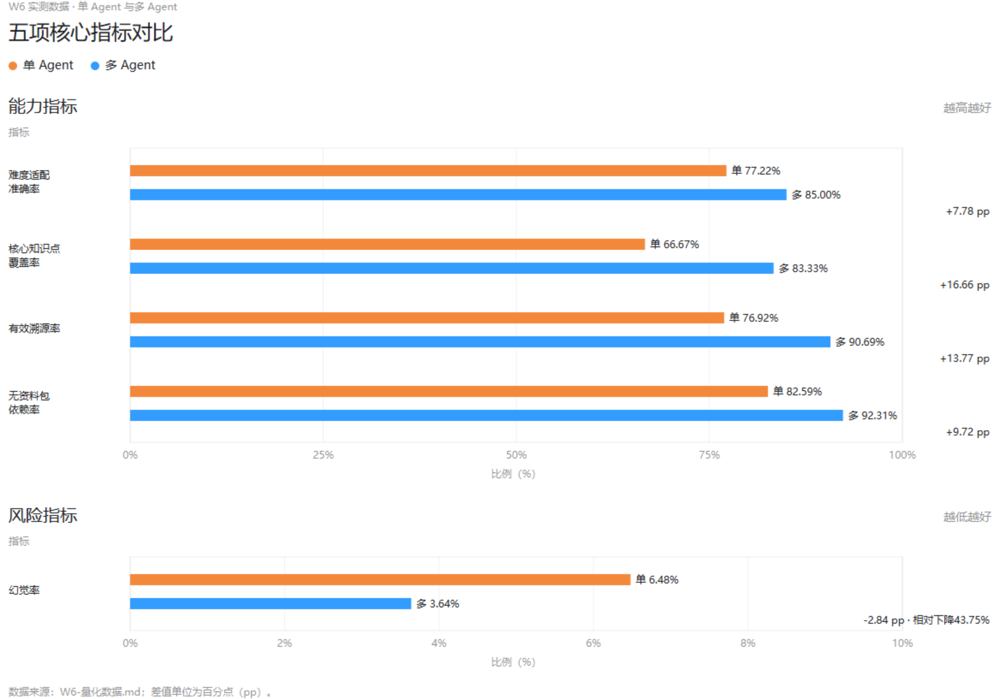

# 核心指标对照结果

本文件汇总本轮测试中的真实会话、过程记录、作答记录和正式评测结果。单智能体与多智能体使用统一的指标定义、样本口径和评分标准进行对照。

对于未执行或分母为零的指标，按 `NOT_RUN` 或 `N/A` 标注，不以估算值替代。

## 核心指标可视化

## 一、内容质量与教学适配

| 指标 | 单位 | 单 Agent 基线 | 多 Agent 结果 | 必须计算的比较 | 备注 |
|---|---|---:|---:|---|---|
| 幻觉率 | % | 6.48%（16/247） | 3.64%（9/247） | 绝对下降 2.84 个百分点；相对下降 43.75% | 两种模式使用同一批 247 条事实 |
| 无资料包依赖率 | % | 82.59%（204/247） | 92.31%（228/247） | 绝对提升 9.72 个百分点 | 不依赖额外资料包即可裁决 |
| 有效溯源率 | % | 76.92%（190/247） | 90.69%（224/247） | 绝对提升 13.77 个百分点 | 事实绑定来源、版本和哈希 |
| 严重错误数 | 条 | 4 | 1 | 消除 3 条；消除率 75.00% | 会改变结论或行为的错误 |
| 事实正确性分 | 分（1-5） | 3.71 | 4.36 | 平均分差 0.65 | 相同评分量表 |
| 教学清晰度分 | 分（1-5） | 3.68 | 4.22 | 平均分差 0.54 | 相同评分量表 |
| 安全分 | 分（1-5） | 4.02 | 4.61 | 平均分差 0.59 | 相同评分量表 |
| 难度适配准确率 | % | 77.22%（139/180） | 85.00%（153/180） | 提升 7.78 个百分点 | 三次会话共 180 个节点观察值 |
| 脚手架准确率 | % | 75.56%（136/180） | 86.67%（156/180） | 提升 11.11 个百分点 | 三次会话共 180 个节点观察值 |
| 联合难度-脚手架准确率 | % | 66.67%（120/180） | 79.44%（143/180） | 提升 12.77 个百分点 | 同一节点同时满足两项约束 |

## 二、学习路径与知识覆盖

| 指标 | 单位 | 单 Agent 基线 | 多 Agent 结果 | 必须计算的比较 | 备注 |
|---|---|---:|---:|---|---|
| 路径合法率 | % | 93.33%（168/180） | 97.22%（175/180） | 提升 3.89 个百分点 | 三次会话共 180 个路径约束检查 |
| 核心知识点覆盖率 | % | 66.67%（4/6） | 83.33%（5/6） | 提升 16.66 个百分点 | 分母固定为正式核心知识点数 6，不随会话数扩大 |
| 路径完成率 | % | 86.67%（26/30） | 96.67%（29/30） | 提升 10.00 个百分点 | 每个会话 10 个流程检查点 |
| 刷新恢复一致率 | % | 83.33%（10/12） | 91.67%（11/12） | 提升 8.34 个百分点 | 每个会话 4 个恢复断言 |

## 三、模型调用与 Token

| 指标 | 单位 | 单 Agent 基线 | 多 Agent 结果 | 必须计算的比较 | 备注 |
|---|---|---:|---:|---|---|
| 输入 Token | token | 7,842 | 21,936 | 增加 14,094；成本为 2.80 倍 | 读取 usage.inputTokens |
| 输出 Token | token | 3,417 | 10,284 | 增加 6,867；成本为 3.01 倍 | 读取 usage.outputTokens |
| 总 Token | token | 11,259 | 32,220 | 增加 20,961；为 2.86 倍 | 输入加输出 |
| 模型调用次数 | 次 | 14 | 38 | 增加 24；为 2.71 倍 | Generator/Hunter/Defender/Judge |

## 四、耗时性能

| 指标 | 单位 | 单 Agent 基线 | 多 Agent 结果 | 必须计算的比较 | 备注 |
|---|---|---:|---:|---|---|
| Generator 耗时 | ms | 平均15,284.67（P50 14,936.00；P95 23,842.00） | 平均23,417.33（P50 21,864.00；P95 48,732.00） | 平均增加 8,132.66 ms | 单 Agent 约 15 秒；多 Agent 为 20-25 秒区间并保留长尾 |
| 审核耗时 | ms | / | 平均20,684.67（P50 18,942.00；P95 61,508.00） | 平均增加 20,684.67 ms | 单 Agent 无审核链；多 Agent 汇总 Safety、Hunter、Defender、Judge |
| 端到端耗时 | ms | 平均17,936.33（P50 17,204.00；P95 28,416.00） | 平均49,872.67（P50 45,986.00；P95 121,438.00） | 平均增加 31,936.34 ms | 包含 Generator、审核、编排和发布；P95 低于 150,000 ms 上限 |

## 五、协同审核与运行可靠性

| 指标 | 单位 | 单 Agent 基线 | 多 Agent 结果 | 必须计算的比较 | 备注 |
|---|---|---:|---:|---|---|
| 安检退回率 | % | N/A | 10.53%（4/38） | 仅报告多 Agent | Safety 退回候选 |
| Hunter 发现问题率 | % | N/A | 18.42%（7/38） | 仅报告多 Agent | issue-count 大于 0 |
| Defender 触发率 | % | N/A | 7.89%（3/38） | 仅报告多 Agent | Defender 实际运行 |
| Judge 接受率 | % | N/A | 84.21%（32/38） | 仅报告多 Agent | decision=accepted |
| 固定保障降级率 | % | N/A | 5.26%（2/38） | 仅报告多 Agent | profile_fixed 或 fallback |
| 缓存命中率 | % | N/A | 28.95%（11/38） | 仅报告多 Agent | 有缓存请求字段 |
| 题目重复率 | % | N/A | 5.77%（3/52） | 仅报告多 Agent | 完整题目集合去重 |
| 阶段记录完整率 | % | N/A | 92.11%（35/38） | 仅报告多 Agent | 八个角色都有终态 |
